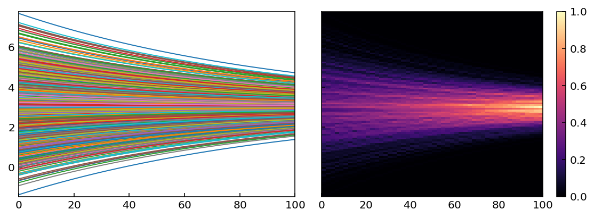

# PyDLC - Density Line Charts with Python
Python implementation of the Density Line Chart [(Moritz &amp; Fisher, 2018)](https://arxiv.org/abs/1808.06019) to visualize large collections of time series.

<p align="center">
  
</p>

## Installation

### Python Package Index

```console
$ pip install pydlc
```

### Requirements
- [numpy](numpy.org/)
- [matplotlib](matplotlib.org/)


## Usage
The following example shows how to import and use the `dense_lines` plotting function.
```python
import numpy as np
import matplotlib.pyplot as plt
from pydlc import dense_lines

# Generate random synthetic time series
x = np.linspace(0, 90, 25)
ys = []
for _ in range(10000):
    ys.append(np.random.randn(1)*np.exp(-x/100))

# Plot here
fig, axs = plt.subplots(1, 2, figsize=(8, 3), sharey=True, sharex=True)
axs[0].plot(x, np.array(ys).T, lw=1)  # this is slow and cluttered
axs[0].set_title('Line Chart')
im = dense_lines(ys, x=x, ax=axs[1], cmap='magma')  # this is fast and clean
axs[1].set_title('Density Lines Chart')
fig.colorbar(im)
fig.tight_layout()
plt.savefig('./figures/example.png', dpi=144, bbox_inches='tight')
plt.show()
```

## Limitations
The vertical grid size can be adjusted with the `ny` parameter. Higher values of `ny` yield a smoother density visualization. However, the horizontal grid size is currently limited to the same size as the input sequences and there is no parameter to adjust it (yet).

## Algorithm
This graphical abstract explains the algorithm ([source](https://idl.cs.washington.edu/papers/dense-lines/)).
<p align="center">
  
</p>
